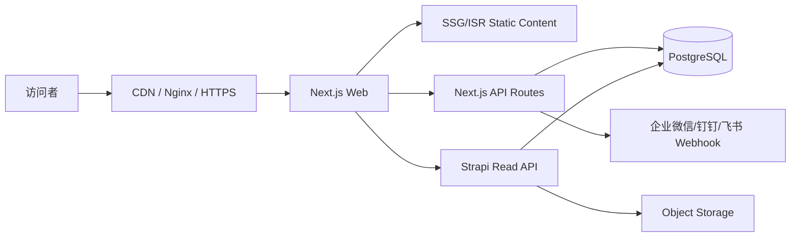

# 星橡官网 CMS、API 与部署规格 V3.4

## 1. 系统架构



## 2. 内容模型

### Page

- title, slug, eyebrow, heroTitle, heroIntro, modules(JSON/Components), seo, complianceNotice, status, updatedAt.

### Industry

- title, slug, englishLabel, relation, summary, points(JSON), logo, displayPriority, isCurrentFocus, isStrategicReserved, complianceCategory, complianceNote, seo.

### Capability

- title, slug, summary, useCases(JSON), priority, complianceNote.

### Article

- title, slug, category, summary, body, tags, cover, publishedAt, seo, requiresComplianceReview.

### Report

- title, slug, summary, status, cover, file, requiresLead, complianceNote, seo.

### Lead

- leadType, name, company, email, phone, topic, message, consent, sourcePath, owner, status, priority, complianceReviewRequired, notes, ipHash, userAgent, utm, receivedAt.

## 3. Lead API

### Endpoint

`POST /api/leads`

### 成功响应

```json
{ "ok": true, "id": "...", "mode": "strapi|preview_without_backend", "message": "信息已提交" }
```

### 错误

- 400 validation_error；
- 429 rate_limited；
- 500 server_error。

### 安全

- 服务器端再次校验；
- 单 IP/指纹限流；
- Honeypot；
- 可选验证码；
- 日志脱敏；
- APEX 主题强制合规标记。

## 4. CMS Fallback

- `STRAPI_API_URL` 未配置或请求失败：回退 `lib/site-data.ts`；
- 公开页面不得因 CMS 不可用而 500；
- CMS 发布后调用 `/api/revalidate`；
- Revalidate 接口必须 Bearer Secret。

## 5. 环境变量

```env
NEXT_PUBLIC_SITE_URL=https://www.staroakx.com
STRAPI_API_URL=
STRAPI_API_TOKEN=
LEAD_NOTIFY_WEBHOOK_URL=
REVALIDATE_SECRET=
CAPTCHA_SECRET=
SITE_OPS_OWNER=
LEAD_OWNER_EMAIL=info@staroakx.com
COMPLIANCE_OWNER=CTO
```

## 6. 部署

- Production：香港云服务器；
- Docker standalone；
- Nginx + SSL + CDN；
- Strapi/PostgreSQL 独立容器或独立主机；
- 数据库每日备份；
- Release Tag；
- `/api/health` 监控；
- T-1 备份、T 日发布、T+72 监测。

## 7. 后期大陆迁移

- 域名备案；
- 大陆 CDN/对象存储；
- 数据与隐私政策复核；
- 第三方分析和字体资源可达性复核；
- 不改变 URL 结构，避免 SEO 损失。
